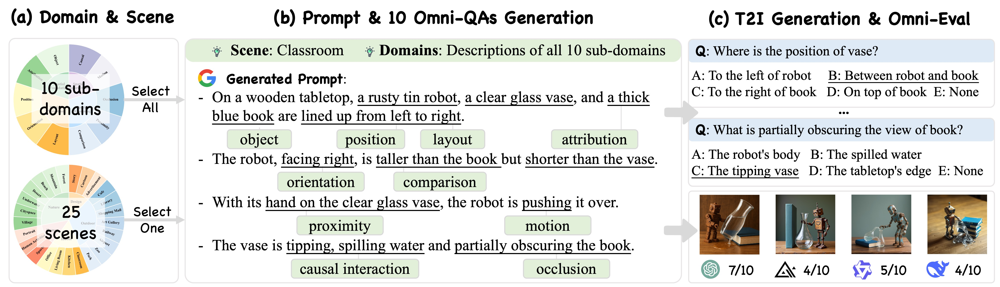
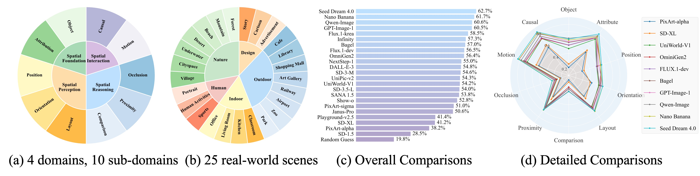
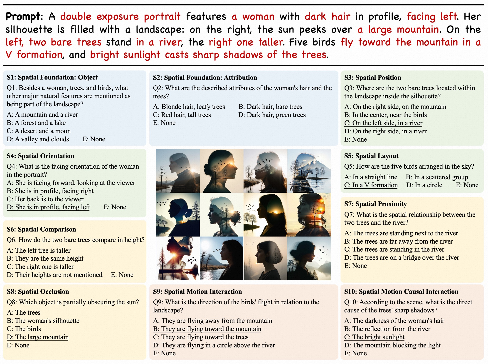
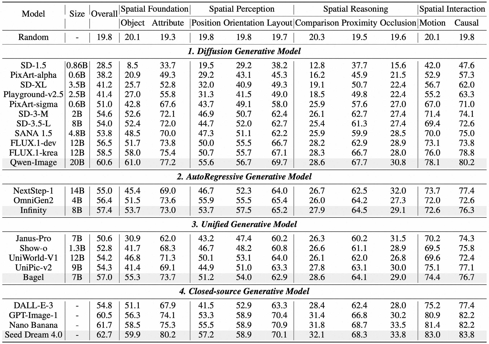
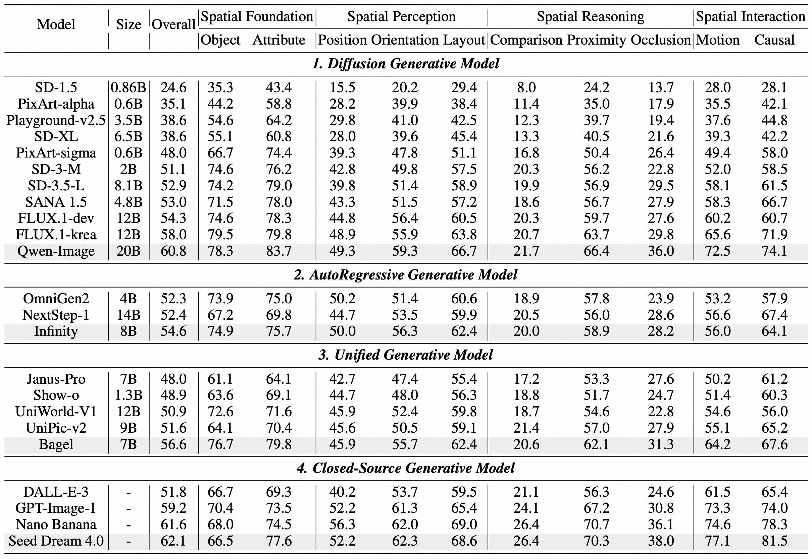

<p align="center">
    
</p>

<div align="center">

  <h1>
    Everything in Its Place: Benchmarking Spatial Intelligence of Text-to-Image Models
  </h1>  

  <p align="center">
    <a href='https://arxiv.org/abs/2601.20354'>
      
    </a>
     &nbsp;
    <a href='https://arxiv.org/abs/2601.20354'>
      
    </a>
  </p>

  **Zengbin Wang**<sup>1,2*</sup>, 
  **Xuecai Hu**<sup>1†</sup>, 
  **Yong Wang**<sup>1†</sup>, 
  **Feng Xiong**<sup>1</sup>, 
  **Man Zhang**<sup>2</sup>, 
  **Xiangxiang Chu**<sup>1</sup>

  <sup>1</sup>AMAP, Alibaba Group,  &nbsp;&nbsp;
  <sup>2</sup>Beijing University of Posts and Telecommunications
  <br>
  <sup>†</sup>Project leads and corresponding authors.

</div></font>

## 🔥 News
  - 🔥 **[2026.01]**: 🎉🎉🎉 Congratulations! Our paper is accepted by ICLR 2026.
  - 🔥 **[2026.01]**: The evaluation data and code is released.

## 📖 Overview of SpatialGenEval
  
  - We introduce **SpatialGenEval**, a new benchmark to systematically evaluate **complex spatial intelligence** in T2I models. It leverages 1,230 **information-dense** prompts, each covering 10 spatial sub-domains and paired with 12,300 **Omni-dimensional multiple-choice questions** to evaluate a model's understanding beyond what to generate, to where, how, and why. 
  - Our extensive evaluation of 23 state-of-the-art models reveals a universal performance bottleneck in spatial reasoning. While models excel at basic object composition, their accuracy falls when faced with tasks requiring higher-order spatial understanding, such as relative positioning, occlusion, and causality, revealing this as a primary barrier to current T2I capabilities.
  - Beyond evaluation, we explore a spatial-aware dataset (SpatialT2I), designed as a practical data-centric solution to improve the spatial intelligence of existing models. Fine-tuning results yield significant and consistent performance gains.

  <p align="center">
      
  </p>

  <p align="center">
      
  </p>

## 💡 Examples

  <p align="center">
      
  </p>

  <p align="center">
      
  </p>

## 🔧 Requirements
  
  - Clone and install the required environment.

    ```bash
    git clone https://github.com/AMAP-ML/SpatialGenEval.git
    cd SpatialGenEval
    
    # You can also use your own envrionment.
    conda create -n spatialgeneval python==3.10 -y
    conda activate spatialgeneval
    pip install torch transformers diffusers modelscope vllm
    ```


## 🎑 Image Generation
  
  - Use T2I prompts from `eval/SpatialGenEval_T2I_Prompts.jsonl` to generate images with your T2I models.

    ```json
    "id": "index of prompt."
    "scene": "name of real-world scene."
    "prompt": "text-to-image prompt (the averaged length is around 66 words to balance compatibility with CLIP encoders (limited by 77 tokens) and the need for high information density)."
    "question_type": "10 spatial dims."
    "questions": "10 omni-dims questions."
    "answers": "10 ground-truth answers."
    ```

  - The image generation demo is in `scripts/generation_demo.py`. It support spliting the generation tasks to each GPU for parallel generation. 

    ```bash
    json_file="eval/SpatialGenEval_T2I_Prompts.jsonl"
    model_name="Qwen/Qwen-Image"               # e.g., Qwen/Qwen-Image
    save_folder="<YOUR_GENERATED_IMAGE_PATH>"  # e.g., ./images/Qwen-Image
    TOTAL_GPUS=8                               # i.e., The expected used GPUs
    for i in $(seq 0 ${TOTAL_GPUS})
    do
        CUDA_VISIBLE_DEVICES=$i \
        python scripts/generation_demo.py \
            --model_name=${model_name} \
            --json_file=${json_file} \
            --save_folder=${save_folder} \
            --total_gpus=${TOTAL_GPUS} \
            --gpu_id=$i &
    done
    wait
    ```

  - The generated image folder should be in the format of `<YOUR_GENERATED_IMAGE_PATH>/<ID>.png` as follows.
    
    ```python
    <YOUR_GENERATED_IMAGE_PATH>/
    ├── 000001.png
    ├── 000002.png
    ├── ...
    ├── 001230.png
    ```
  
## 🚀 Run Evaluation with [Qwen2.5-VL-72B-Instruct](https://huggingface.co/Qwen/Qwen2.5-VL-72B-Instruct) (based on VLLM)

  - The evaluation script based on VLLM is in `eval_with_qwen25_vl_72b.sh`. 
    - `EVAL_MODEL_PATH`: the evaluation model path (`./models/Qwen2.5-VL-72B-Instruct`).
    - `YOUR_IMAGE_FOLDER`: the generated image folder path.
    - `OUTPUT_JSON_PATH`: the output json path of evaluation results.

    ```bash
    EVAL_MODEL_PATH="<EVAL_MODEL_PATH>"              # e.g., ./models/Qwen2.5-VL-72B-Instruct
    YOUR_GENERATED_IMAGE_PATH="<YOUR_GENERATED_IMAGE_PATH>"  # e.g., ./images/Qwen-Image
    OUTPUT_JSON_PATH="<OUTPUT_JSON_PATH>"            # e.g., ./logs/Qwen-Image-results.jsonl

    bash eval_with_qwen25_vl_72b.sh \
        "${YOUR_GENERATED_IMAGE_PATH}" \
        "${OUTPUT_JSON_PATH}" \
        "${EVAL_MODEL_PATH}"
    ```
  
  - The final evaluation json results will be saved in `<OUTPUT_JSON_PATH>`.

## 📊 Evaluation Results
  
  - Evaluation results based on Qwen2.5-VL-72B-Instruct as the judge model.

  <p align="center">
      
  </p>

  - Evaluation results based on GPT-4o as the judge model.
  <p align="center">
      
  </p>


## ✍️ Citation
  
  If you find this codebase useful in your research, please consider giving us a star ⭐ and citing our work 📝:
  
  ```
  @article{wang2026everything,
    title={Everything in Its Place: Benchmarking Spatial Intelligence of Text-to-Image Models},
    author={Wang, Zengbin and Xuecai and Wang, Yong and Xiong, Feng and Zhang, Man and Chu, Xiangxiang},
    journal={arXiv preprint arXiv:2601.20354},
    year={2026}
  }
  ```
